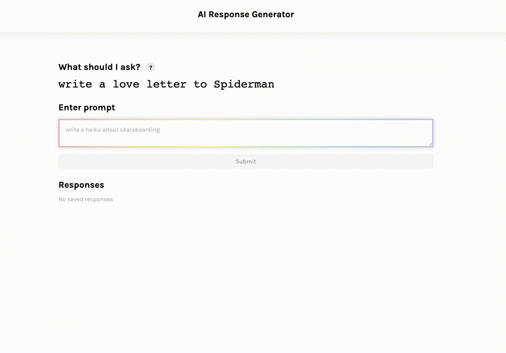

# AI Response Generator
An app that sends text prompts to the OpenAI API and displays the results in a list. The AI model generates a text completion that attempts to match whatever context or pattern you give it!

[Click here](https://ai-response-generator.herokuapp.com/) to view the app.

## How It's Made
**Tech used:** HTML, CSS, JavaScript, React

## Lessons Learned
- **Never expose API keys in client-side code!** I set my API key in a .env file and added it to .gitignore to avoid pushing my API key to GitHub. If the key gets compromised, OpenAI triggers a key rotation and a new API key is assigned. To deploy my project with Heroku, I used [config vars](https://devcenter.heroku.com/articles/config-vars#using-the-heroku-dashboard) to set the API key as an environment variable.
